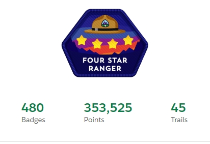

# Current Work

## Salesforce Architect, Developer, Admin

**Salesforce Certifications**

- Salesforce Certified Application Architect
- Salesforce Certified Data Architect
- Salesforce Certified Sharing and Visibility Architect
- Salesforce Certified Administrator
- Salesforce Certified Platform App Builder
- Salesforce Certified Platform Developer I
- Salesforce Certified JavaScript Developer I
- Salesforce Certified Service Cloud Consultant
- Salesforce Certified CPQ Specialist

# Hobby Work

## LWC

- [Screenflow Confetti](https://github.com/jkenzer/lwc-confetti) - Allows you to trigger a confetti canon in your screenflows.

## LWC OSS

Using the [Salesforce open source Lightning Web Component](https://lwc.dev) off platform

- [Movie Database](https://github.com/jkenzer/lwc-movie-database) - Building a simple LWC based integration with The Movie Database.
- [Reddit Client](https://github.com/jkenzer/reddit-lwc) - Building a simple reddit client using a custom @wire and playing with the UI using [SLDS](https://www.lightningdesignsystem.com)

## Other frameworks

- [MLS Stickers](https://github.com/jkenzer/mls-stickers) - Learning some of the basics of Svelte and how they compare to Lightning Web Components.

## P5.js

- [Sketches in Github](https://jkenzer.github.io/)
- [P5.js Editor Sketches](https://editor.p5js.org/jkenzer/sketches)

## Raspberry Pi

- [Pimoroni](https://github.com/jkenzer/pimoroni) - Playing with the [Pimoroni Unicorn HAT HD](https://shop.pimoroni.com/products/unicorn-hat-hd)

## Adafruit Magtag

- [Magtag](https://github.com/jkenzer/magtag) - Magtag code to pull JSON data from raspberrypi to display custom messages on my fridge.
- [Magtag Server Code](https://github.com/jkenzer/magtag-server) - Internal nodejs server running on a raspberrypi feeding JSON data to my magtag.

## Codewars

- [Codewars](https://www.codewars.com/) - When I want to code but don't want to work on a project, I like to do some codewars katas.
- [My profile](https://www.codewars.com/users/jkenzer)
